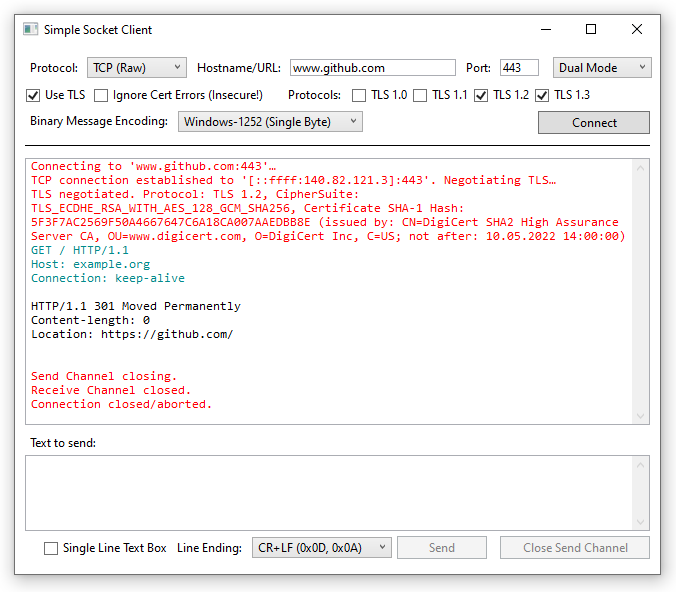
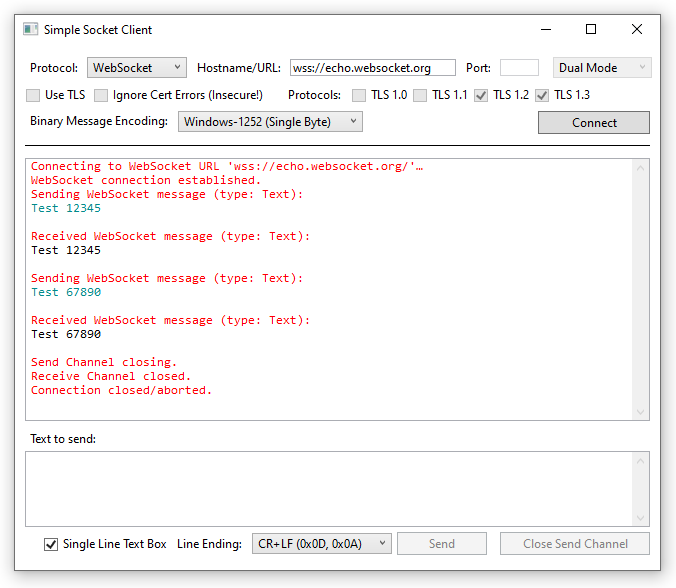

# Simple Socket Client (Windows)

A simple .NET WPF application that can be used to establish TCP (raw) or WebSocket connections and exchange
text messages for testing/debugging purposes.

- Supports TCP connections with a dual-mode socket (IPv6 and IPv4) and optionally using TLS
- Supports WebSocket connections (sending text messages and receiving text or binary messages)
- Supports half-closing the socket (send channel) before fully closing it
- Binary messages are encoded/decoded using a specified encoding like Windows-1252 (1 charater per byte) or UTF-8

## Example (TCP):

## Example (WebSocket):

